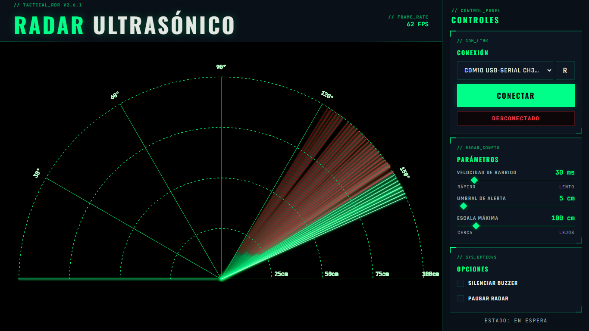

# Radar Ultrasónico Web

Interfaz web portable para un radar ultrasónico con Arduino, sensor HC-SR04, servomotor y buzzer.  
La aplicación lee datos por puerto serie, dibuja el barrido del radar en el navegador y permite controlar velocidad, umbral de alerta, pausa y silencio del buzzer.



## Descarga Recomendada

Para usar el proyecto en otra PC, descargá el archivo del release:

```text
RadarWebPortable.zip
```

Después descomprimilo y ejecutá:

```text
RadarUltrasonicoWeb.exe
```

La aplicación abre una interfaz local en el navegador:

```text
http://127.0.0.1:8765
```

## ¿Hace Falta Instalar Python?

No.  
La versión portable incluida en `RadarWebPortable.zip` ya trae Python y `pyserial` empaquetados dentro del ejecutable generado con PyInstaller.

En una PC destino solo necesitás:

- Windows.
- Un navegador web moderno, por ejemplo Microsoft Edge, Chrome o Firefox.
- Driver USB de la placa Arduino o conversor USB-Serie.
- El Arduino cargado con el firmware correcto.

## Hardware Necesario

- Arduino UNO, Nano o compatible.
- Sensor ultrasónico HC-SR04.
- Servomotor.
- Buzzer.
- Cable USB de datos.
- Jumpers.

Conexiones usadas por el firmware:

```text
HC-SR04 TRIG  -> pin 10
HC-SR04 ECHO  -> pin 11
Servo señal   -> pin 9
Buzzer        -> pin 6
Baudrate      -> 9600
```

## Uso Rápido

1. Cargá el firmware en el Arduino.
2. Conectá el Arduino por USB.
3. Ejecutá `RadarUltrasonicoWeb.exe`.
4. Esperá que se abra el navegador.
5. Elegí el puerto COM desde la interfaz.
6. Presioná `CONECTAR`.

Si el navegador no se abre automáticamente, entrá manualmente a:

```text
http://127.0.0.1:8765
```

## Firmware

El firmware recomendado está en:

```text
RadarWebPortable/firmware/Proyecto_RADAR_ultras_nico.ino
```

También está en el código fuente:

```text
Radar con Python/Proyecto_RADAR_ultras_nico/Proyecto_RADAR_ultras_nico.ino
```

El Arduino envía datos por serial en este formato:

```text
angulo,distancia
```

Y acepta estos comandos desde la interfaz:

```text
VEL:<ms>
THR:<cm>
MUTE:<0|1>
PAUSE:<0|1>
```

## Drivers USB

Si el puerto COM no aparece, probablemente falte el driver USB de la placa.

Casos comunes:

- Placas compatibles con chip CH340/CH341: instalar driver CH340.
- Placas con chip CP210x: instalar driver Silicon Labs CP210x.
- Arduino original: normalmente Windows lo reconoce, pero puede requerir Arduino IDE o driver oficial.

Podés incluir en el release una carpeta opcional:

```text
drivers/
installers/
```

Una buena opción para entornos escolares o PCs sin preparación previa es incluir el instalador de Arduino IDE Legacy, porque también ayuda a instalar drivers y permite cargar el firmware.

## Estructura Del Paquete Portable

```text
RadarWebPortable/
  LEEME_PRIMERO.md
  RadarUltrasonicoWeb.exe
  static/
    index.html
  firmware/
    Proyecto_RADAR_ultras_nico.ino
  docs/
    README_PORTABLE_WEB.md
    CONEXION_ARDUINO.md
    EMPAQUETADO.md
```

## Ejecutar Desde Código Fuente

Si querés correr el proyecto sin el `.exe`, instalá Python y las dependencias:

```bat
python -m pip install -r requirements-web.txt
tools\run_web_source.bat
```

O manualmente:

```bat
python "Radar con Python\server.py"
```

## Compilar El Ejecutable

Desde la raíz del proyecto:

```bat
tools\build_web_exe.bat
```

El ejecutable se genera en:

```text
dist/RadarUltrasonicoWeb.exe
```

Después podés crear o actualizar el paquete:

```text
RadarWebPortable.zip
```

## Solución De Problemas

### No aparece ningún puerto COM

- Revisá que el cable USB sea de datos.
- Probá otro puerto USB.
- Abrí el Administrador de dispositivos.
- Instalá el driver CH340/CH341 o CP210x según tu placa.
- Cerrá Arduino IDE u otros monitores serie antes de conectar desde la app.

### La app abre pero no recibe datos

- Verificá que el firmware correcto esté cargado.
- Confirmá que el baudrate sea `9600`.
- Presioná `CONECTAR` en la interfaz.
- Revisá que el Arduino no esté usando otro sketch.

### El navegador no abre

Entrá manualmente a:

```text
http://127.0.0.1:8765
```

### Windows muestra advertencia de seguridad

Es normal en ejecutables descargados desde Internet que no están firmados digitalmente.  
Si el archivo viene del release oficial del proyecto, se puede permitir la ejecución.

## Notas Para Publicar En GitHub Releases

Assets recomendados del release:

```text
RadarWebPortable.zip
Arduino IDE Legacy installer, opcional
Driver CH340/CH341, opcional
Driver CP210x, opcional
```

Texto breve sugerido para el release:

```text
Versión portable de la interfaz web del radar ultrasónico.
No requiere instalar Python. Incluye ejecutable, firmware Arduino y documentación básica.
Si el puerto COM no aparece, instalar el driver USB correspondiente a la placa.
```

## Licencia

Definí una licencia antes de publicar si querés que otras personas puedan reutilizar o modificar el proyecto formalmente. Para proyectos educativos, MIT suele ser una opción simple.
